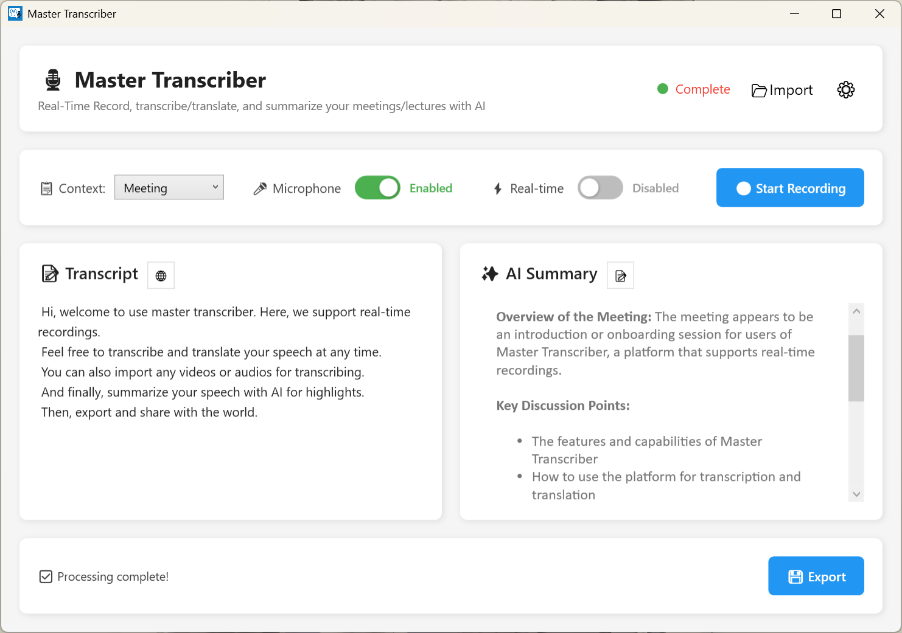

# 🎙️ Master Transcriber

A powerful Windows desktop application for recording, transcribing, and summarizing meetings and lectures with AI. Built with WPF and C#, featuring real-time transcription, video/audio transcription, multi-language translation, and both local and cloud AI support.


## ✨ Features


### 🎯 Core Functionality
- **Audio Recording**: Capture system audio and microphone simultaneously or separately
- **Real-Time Transcription**: See transcripts appear live as you speak (configurable 5-300 second intervals)
- **Video/Audio Transcription**: Transcribe and summarize your video or audio in seconds!
- **AI Summarization**: Generate concise summaries with key highlights and action items
- **Multi-Language Translation**: Translate transcripts to 8+ languages using DeepL
- **Smart Chunking**: Automatically splits long recordings (>10 minutes) for efficient processing
- **Markdown Rendering**: View AI summaries with beautiful markdown formatting

### 🔧 Flexible Configuration
- **Local or Cloud**: Choose between local models (Whisper.cpp, Ollama) or cloud APIs (Azure STT, OpenRouter)
- **Mixed Mode**: Use local transcription with cloud summarization (or vice versa)
- **Customizable Settings**: Adjust real-time intervals, enable/disable features, configure API keys

## 🚀 Quick Start

### Prerequisites
- Windows 10/11
- .NET 8.0 Runtime
- (Optional) Whisper.cpp for local transcription
- (Optional) Ollama for local AI summarization

### Installation
1. Go to [Release page](https://github.com/LoveIiei/TranscribeMeeting/releases) and download the newest version to your PC  
2. Extract the contents out from the zip folder, and go into publish folder  
2. Double-click TranscribeMeetingUI.exe to run the app
4. Enjoy!

*For Dev:*  
1. **Clone the repository**
```bash
git clone https://github.com/yourusername/meeting-transcriber.git
cd meeting-transcriber
```

2. **Install dependencies**
```bash
dotnet restore
```

3. **Build the project**
```bash
dotnet build
```

4. **Run the application**
```bash
dotnet run --project TranscribeMeetingUI
```

### First-Time Setup

1. Launch the application
2. Click the ⚙️ Settings button
3. Configure your preferred services:
   - **For Local Setup**: Provide paths to Whisper.cpp and Ollama
   - **For Cloud Setup**: Enter your API keys (Azure, OpenRouter, DeepL)
#### 1. LLM (Ollama)
The app uses [Ollama](https://ollama.com/) to run local Large Language Models.
*   **Installation:** Download and install Ollama for your OS.
*   **Download a Model:** Pull a model from the Ollama library. We recommend starting with `Llama 3.1 8B`.  
    Run this command in your terminal:
    ```bash
    ollama pull llama3.1:8b
    ```
*   **Keep Ollama Running:** The Ollama background service is all that's needed. The app will automatically detect your downloaded models and show them in the settings panel dropdown.

#### 2. Speech-to-Text (Whisper.cpp)
The app connects to a [Whisper.cpp](https://github.com/ggerganov/whisper.cpp) for local transcription.
*   **Installation:** Download the appropriate pre-built binary from the [Whisper.cpp releases page](https://github.com/ggerganov/whisper.cpp/releases).
    *   For **NVIDIA GPU** users on Windows (recommended): Download `whisper-cublas-....zip`.
    *   For **CPU-only** on Windows: Download `whisper-bin-x64.zip`.
    *   For **MAC**: Clone the repo and build the APP
*   **Download a Model:** Download a quantized Whisper model. `ggml-base.en-q8_0.bin` is a fast, high-quality starting point from [Huggingface](https://huggingface.co/ggerganov/whisper.cpp/tree/main)
*   **Configuration:** You will provide the path to `whisper-cli.exe` and the `.bin` model file in the app's settings panel. The app will launch and manage the server for you.
---
✅ **Cloud Mode (Optional):**
        **LLM:** [OpenRouter](https://openrouter.ai/) 
        **STT:** [Microsoft Azure Speech](https://azure.microsoft.com/en-us/products/ai-services/speech-to-text).

4. Click Save and start recording!

## 📖 Usage

### Basic Recording

1. **Toggle Microphone**: Enable/disable microphone input (system audio always recorded)
2. **Click Start Recording**: Begin capturing audio
3. **Click Stop Recording**: End capture and start processing
4. **View Results**: See transcript and AI summary
5. **Export**: Save results in your preferred format

### Real-Time Mode

1. **Enable Real-Time**: Toggle the ⚡ Real-time switch before recording
2. **Start Recording**: Transcription appears automatically every 30 seconds (configurable)
3. **Toggle Translation**: Click 🌐 to switch between original and translated text
4. **Stop When Done**: AI summary generated from all segments

### Translation

1. **Enable in Settings**: Provide DeepL API key and select target language
2. **During Recording**: Translation happens automatically in real-time mode
3. **After Recording**: Click 🌐 button to translate on-demand
4. **Toggle Views**: Switch between original and translated text anytime

## ⚙️ Configuration

### Settings Overview

#### 🎙️ Transcription Provider
- **Local (Whisper.cpp)**: Free, runs on your GPU/CPU
  - Requires: Whisper CLI path and model file (.bin)
  - Models: tiny, base, small, medium, large
- **Azure Speech-to-Text**: Cloud-based, fast and accurate
  - Requires: Azure API key and region

#### ✨ AI Summary Provider
- **Local (Ollama)**: Free, runs locally
  - Requires: Ollama installed and running
  - Configure: Model name (e.g., llama3.1:8b) and URL
- **OpenRouter API**: Cloud-based, access to multiple models
  - Requires: OpenRouter API key
  - Configure: Model name (e.g., anthropic/claude-3-sonnet)

#### 🌐 Translation (Optional)
- **DeepL API**: Professional translation service
  - Requires: DeepL API key (free tier available)
  - Supported: English, Spanish, French, German, Italian, Japanese, Korean, Chinese

#### ⚡ Real-Time Mode
- **Chunk Interval**: 5-300 seconds (default: 30)
  - Lower = Faster updates, higher CPU usage
  - Higher = Less frequent updates, lower CPU usage

#### 🔧 General
- **Enable AI Summary**: Toggle summary generation
- **Auto-Export**: Automatically save after processing

## 🛠️ Technical Stack

### Core Technologies
- **Framework**: .NET 8.0 / WPF
- **Audio**: NAudio (WASAPI loopback capture, audio mixing)
- **Transcription**: Whisper.cpp / Azure Cognitive Services
- **AI**: Ollama / OpenRouter (Claude, GPT, etc.)
- **Translation**: DeepL API
- **Markdown**: Markdig.Wpf for rendering

## 📁 Project Structure

```
TranscribeMeetingUI/
├── MainWindow.xaml              # Main UI
├── MainWindow.xaml.cs           # Main logic
├── SettingsWindow.xaml          # Settings UI
├── SettingsWindow.xaml.cs       # Settings logic
├── AppSettings.cs               # Configuration management
├── Recorder.cs                  # Audio recording with mixing
├── RealTimeTranscriber.cs       # Live transcription handler
├── Transcriber.cs               # Local/Azure transcription
├── Summarizer.cs                # Local/Cloud AI summarization
├── ChunkedProcessor.cs          # Long recording handler
├── AzureSTTHandler.cs           # Azure Speech-to-Text
├── OpenRouterHandler.cs         # OpenRouter API integration
├── DeepLTranslator.cs           # DeepL translation
```

## 🔒 Privacy & Security

- **Local Processing**: Use local models (Whisper, Ollama) for complete privacy
- **No Data Storage**: Application doesn't store recordings or transcripts permanently
- **API Keys**: Stored locally in `%AppData%/MasterTranscriber/settings.json`
- **Temporary Files**: Cleaned up after processing

## 🐛 Troubleshooting

### Common Issues

**Whisper.cpp not creating transcript:**
- Ensure Whisper CLI path is correct
- Check model file (.bin) exists and is valid
- Verify output directory has write permissions

**Audio recording is silent:**
- Check system audio is playing
- Verify microphone permissions in Windows settings
- Try toggling microphone on/off

**Real-time transcription not working:**
- Ensure chunk interval is set (5-300 seconds)
- Check Whisper.cpp or Azure STT is configured
- Look for errors in debug output (Visual Studio Output window)

**Translation fails:**
- Verify DeepL API key is valid
- Check internet connection
- Ensure target language is supported

**Duration mismatch (file longer than actual recording):**
- This was a bug in mixing - ensure you're using the latest code
- Check debug output for "Discrepancy ratio" (should be ~1.0x)

## 🤝 Contributing

Contributions are welcome! Please feel free to submit a Pull Request.

1. Fork the repository
2. Create your feature branch (`git checkout -b feature/AmazingFeature`)
3. Commit your changes (`git commit -m 'Add some AmazingFeature'`)
4. Push to the branch (`git push origin feature/AmazingFeature`)
5. Open a Pull Request

## 🙏 Acknowledgments

- [NAudio](https://github.com/naudio/NAudio) - Audio recording and processing
- [Whisper.cpp](https://github.com/ggerganov/whisper.cpp) - Local speech-to-text
- [Ollama](https://ollama.ai/) - Local AI models
- [Markdig](https://github.com/xoofx/markdig) - Markdown rendering
- [Azure Cognitive Services](https://azure.microsoft.com/en-us/services/cognitive-services/) - Cloud transcription
- [OpenRouter](https://openrouter.ai/) - Multi-model AI access
- [DeepL](https://www.deepl.com/) - Professional translation

---

⭐ If you find this project useful, please consider giving it a star on GitHub!
